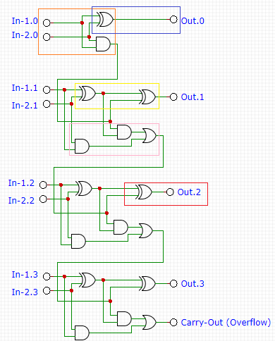

# [Day24](https://adventofcode.com/2024/day/24)

## Input
Example input:
```
x00: 1
x01: 1
x02: 1
y00: 0
y01: 1
y02: 0

x00 AND y00 -> z00
x01 XOR y01 -> z01
x02 OR y02 -> z02
```

## Part 1

### Problem
The problem involves simulating a digital circuit composed of boolean logic gates. Each gate has two inputs and one output, with possible operations being:
- **AND**: Outputs 1 if both inputs are 1; otherwise, outputs 0.
- **OR**: Outputs 1 if at least one input is 1; otherwise, outputs 0.
- **XOR**: Outputs 1 if inputs are different; otherwise, outputs 0.

The input consists of:
- A set of initial wire values.
- A list of logic gates defining how values propagate through the circuit.

### Solution
To simulate the circuit, we:
1. Parse the input to extract initial wire values and gate operations.
2. Iteratively process the gates, ensuring both inputs have values before computing outputs.
3. Store computed values in a dictionary.
4. Convert the final values of wires starting with 'z' into a binary number and then to a decimal.

Example Code Implementation
```csharp
private static Dictionary<string, int> _wires = new();
private List<(string wire1, string wire2, string output, Func<string, string, int> operation)> _gates = new();

public string Solve()
{
    var gatesToCheck = _gates;
    while (gatesToCheck.Count > 0)
    {
        var tasksNotPossibleToProcess = new List<(string, string, string, Func<string, string, int>)>();
        foreach (var task in gatesToCheck)
        {
            if (!_wires.ContainsKey(task.wire1) || !_wires.ContainsKey(task.wire2))
            {
                tasksNotPossibleToProcess.Add(task);
                continue;
            }

            var taskValue = task.operation(task.wire1, task.wire2);
            _wires[task.output] = taskValue;
        }

        gatesToCheck = tasksNotPossibleToProcess;
    }

    long output = 0;
    foreach (var wire in _wires.Keys.Where(wire => wire.StartsWith('z')).OrderDescending())
    {
        output = output * 2 + _wires[wire];
    }

    return output.ToString();
}

private Func<string, string, int> SelectOperation(string operation)
{
    return operation switch
    {
        "XOR" => (s1, s2) => _wires[s1] ^ _wires[s2],
        "AND" => (s1, s2) => _wires[s1] & _wires[s2],
        _ => (s1, s2) => _wires[s1] | _wires[s2],
    };
}

```

After processing, the system outputs a decimal number by converting the binary sequence formed by 'z' wires.

## Part 2

### Problem
The system described in input is a faulty adder. 
The system of gates and wires has four pairs of gates which need their output wires swapped - eight wires in total. 
Determine which four pairs of gates need their outputs swapped so that your system correctly performs addition.

### Solution
As the input contains only `OR`, `AND` and `XOR` gates, it will be full adder suing those gates.

Basing on that we can create a list of rules that working adder cannot break:
- Input from `x` and `y` wire needs to goto `AND` and `XOR` gates - orange rule
- The output from 1st XOR gate can't go directly to `z` output besides 1st pair (x0 and y0) - blue rule
- The output from 1st XOR should go to next XOR and be connected to output from `AND` gate from previous module - yellow rule
- The output from 2nd XOR should be always connected to `z` output - red rule
- Both `AND` gates in module should be connected to `OR` gate - pink rule



Basing on those rules you can check which gates are incorrect.

Example code:
```csharp
private void CheckInputs()
{
    foreach (var add in _xyAdd)
    {
        if (add.Input1 == "x00" || add.Input1 == "y00")
        { continue; }
    
        //If 1st XOR is connected to z output it's incorrect besides x00 and y00 case
        //If output from this gate is not connected to 2nd XOR that's incorrect
        if (add.Output.StartsWith('z') || !_outputs.Any(g =>g.Input1 == add.Output || g.Input2 == add.Output))
            _incorrect.Add(add);
    }
    
    foreach (var carry in _xyCarries)
    {
        if (carry.Input1 == "x00" || carry.Input1 == "y00")
        { continue; }
    
        //AND gate connected to x and y input
        //If the gate output is connected to z wire that incorrect
        //If output from this gate is not connected to OR that's incorrect
        if (carry.Output.StartsWith('z') || !_carries.Any(g =>g.Input1 == carry.Output || g.Input2 == carry.Output))
            _incorrect.Add(carry);
    }
}

 private void CheckOutputs()
 {
     foreach (var output in _outputs)
     {
         //If 2nd XOR output is not connected to z wire it's incorrect
         if (!output.Output.StartsWith('z'))
             _incorrect.Add(output);
     }
     
     foreach (var and in _ands)
     {
         //If any 2nd AND is connected to z wire it's incorrect
         if (and.Output.StartsWith('z'))
             _incorrect.Add(and);
     }

     foreach (var carry in _carries )
     {
         //If any OR gate is connected to z wire it's incorrect, besides last carry z45
         if (carry.Output.StartsWith('z') && carry.Output != "z45")
             _incorrect.Add(carry);
     }
}
```
