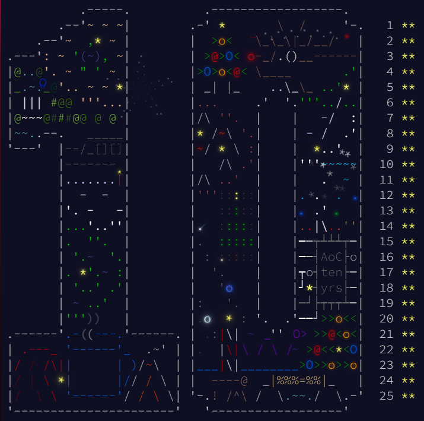

# Advent of Code 2024 Solutions in C#

This repository contains my solutions to all the problems from [Advent of Code 2024](https://adventofcode.com/2024) written in C#. 🎄

The challenges this year were both funny and tricky. Some of them made me think outside the box, while others tested my problem-solving skills to the limit. But overall, it was a fun experience solving each day's puzzle!

I'll definitely be participating in next year's Advent of Code edition, and I look forward to more coding challenges and fun. 💻🎉

Feel free to explore the code, leave suggestions, or just follow along as I continue to improve my problem-solving skills!

## Happy Coding! 🚀

